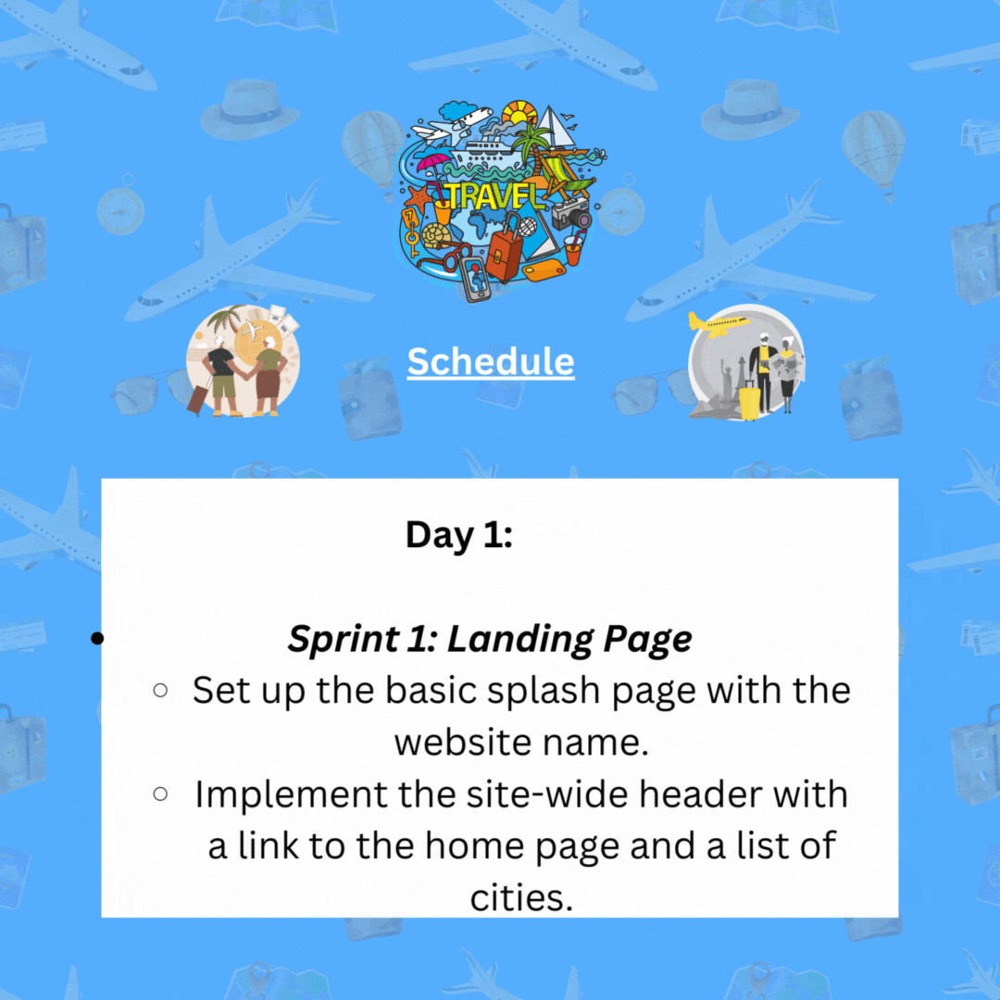
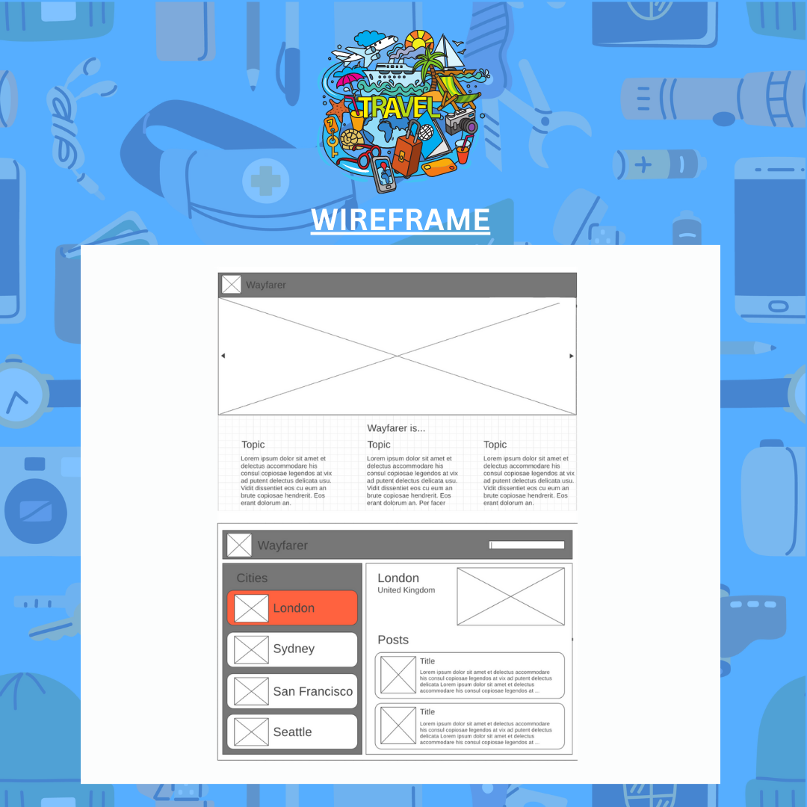
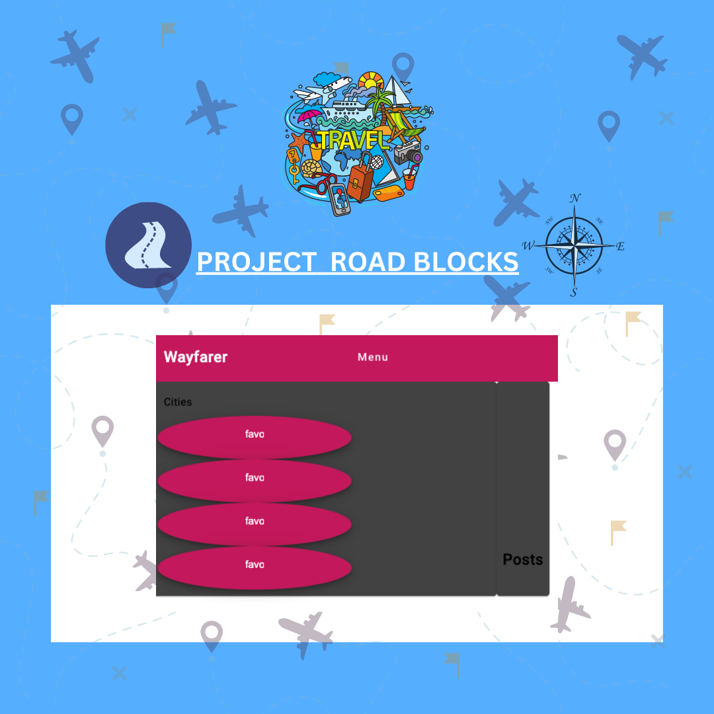
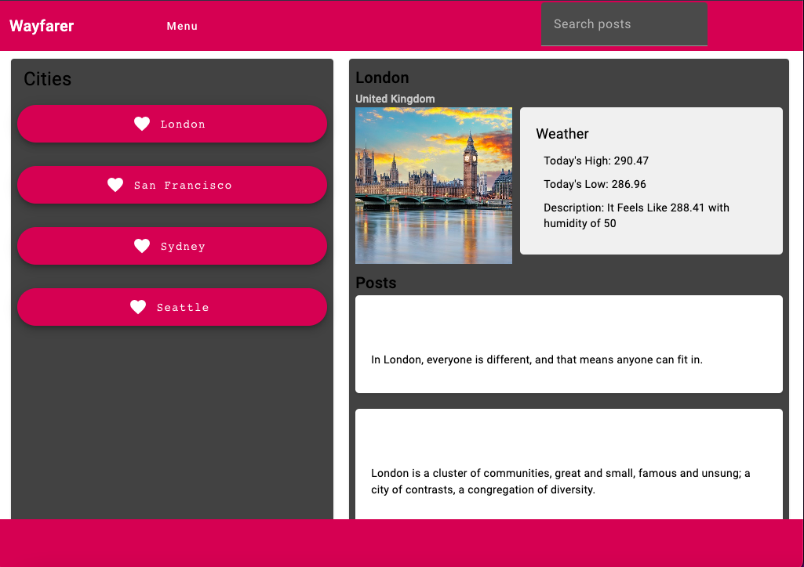

# Project Wayfarer: A  Travel Community Application

The Wayfarer Travel App is a group project aimed at creating a platform where users can share city-specific tips, experiences, and recommendations. 

A travel community application to share sightseeing around their favorite locations.
Whether it's a hidden gem, a must-visit landmark, a local restaurant, or a unique cultural experience, this app allows travelers to discover and contribute valuable information about their favorite locations around the world.

  # Table of Contents

- [Project Overview](#project-overview)
- [Planning Documentation](#planning-documentation)
  - [Schedule](#schedule)
  - [User Stories](#user-stories)
    - [Sprint 1: Landing Page](#sprint-1-landing-page)
    - [Sprint 2: HomePage](#sprint-2-homepage)
    - [Sprint 3: Validations](#sprint-3-validations)
    - [Sprint 4: Weather API](#sprint-4-weather-api)
  - [Wireframe](#wireframe)
  - [Angular Component Architecture](#angular-component-architecture)
- [Wins & Hurdles](#hurdles-and-wins )
- [Tools and Technologies](#tools-and-technologies)
- [Tech Stack](#tech-stack)
- [Technologies Used](#technologies-used)
- [Installation](#installation)
- [Usage](#usage)
- [Contributing](#contributing)
- [Credits](#credits)
- [Contact](#contact)
- [License](#license)

## Project Overview
Our team concurred to build a community travel application aimed at creating a platform where users can share city-specific tips, experiences, and recommendations. Whether it's a hidden gem, a must-visit landmark, a local restaurant, or a unique cultural experience, this app allows travelers to discover and contribute valuable information about their favorite locations around the world.

Once you follow the installation instructions to interact with the application via your browser, you are greeted with an enthusiastic recreational vehicle on the homepage.  From the 'Menu' option on the toolbar, you can click on the 'Cities' menu option.  From the 'Cities' page you can view an iconic picture of that city, current weather conditions, view and access shared city's post, with the newest post first.  To access a specific post to view the post's author, title and content, just click that post's title to view on the 'Show' post page.  You will be able to navigate back 'Home' or 'Cities' page via the menu on the toolbar.

Also, from the 'Cities' page you will be able to search all posts for a specific city when you type in the 'Search City's Post' section on the toolbar.

## Planning Documentation 

### Schedule

### User Stories
####   Sprint 1: Landing Page

1. As a user, I want to be able to navigate to the website's landing page ("/") and see a basic splash page displaying the name of the website.

2. As a user, I expect to see a site-wide header on every page with a link to the home page and a list of cities.

####  Sprint 2: HomePage

1. As a user, I want to view the "San Francisco" page ("/cities/1") which includes the site-wide header, the city name, and an iconic photo of the city.

2. As a user, I want to see a list of posts on the San Francisco page, sorted by newest first, with the post titles linked to individual post "show" pages.

3. As a user, I need the ability to use the search bar to search through the titles and content of the posts.

4. As a user, I should be able to click on the title of a post and be redirected to a "show" page to view the details of that post.

####  Sprint 3: Validations

1. As a user, I should be able to view city pages for "London" and "Gibraltar".

2. As a user, I expect the post title to have a minimum length of 1 character and a maximum length of 200 characters.

3. As a user, I want to ensure that a post's content cannot be empty.

####  Sprint 4: Weather API

1. As a user, I want the website to call the Open Weather API for each city to display the current weather on each city's page.

### Wireframe

### Angular Component Architecture

##  Hurdles And Wins 

<ins>Eugene Brown</ins> - We had some minor disagreements and bug validation errors which were overcome by collaborating effectively and understanding that as a team, Communication is key and we have to communicate constantly and efficiently and be willing to listen to input from others at all times.  

<ins>Wanda Avery</ins> - Implementing the 'Search City's Post' feature:  Learning a little more about <b>observers, observable, and subject (RxJs) components.</b> This was needed to get the two components to communicate through a shared service.  Then getting the correct data to view/show in the component once the filtered results returned or not and then show the initial set of posts once text was removed.  Thanks to Tobe, the feature was implemented as seen in the application.

##  Tools and Technologies 
The following technologies and tools are used in this project:

- Angular
- TypeScript
- HTML/CSS
- Weather API

##  Tech Stack

  
  
  &nbsp;
  &nbsp;
  &nbsp;
  &nbsp;
  &nbsp;
  
  &nbsp;
  

## Technologies Used
- Angular
- TypeScript
- Material UI
- HTML/CSS
- Open Weather API

## Installation
To run the Travel Community App locally, follow these steps:

1. Clone the repository: `git clone <repository-url>`
2. Install the necessary dependencies: `npm install`
3. Run the app locally: `ng serve`
4. Access the app in your browser at `http://localhost:4200`.

##  Usage 

##  Contributing

We welcome contributions from the community to enhance the Travel Community App. If you have any ideas, bug fixes, or improvements, please submit a pull request. 
Make sure to follow the existing code style and guidelines. You can also create new issues to report bugs or suggest new features.

##  Credits 
We appreciate the time and effort follow developers put into making suggestions and code snippets available on [Stack Overflow](https://stackoverflow.com/) regarding anything Angular.

We are thankful and appreciative for the awesome articles and pictures of the vairies cities:

- [World Wide Honey](https://worldwidehoneymoon.com/seattle-3-day-itinerary-weekend-trip-to-seattle/) 
- [Nomadic Matt](https://www.nomadicmatt.com/travel-guides/united-states-travel-guide/seattle/) 
- [freepik](https://www.freepik.com/free-photo/montreal-river-sunset-with-city-lights-urban-buildings_29452819.htm#query=seattle%20city&position=4&from_view=keyword&track=ais) 
- [istock](https://www.istockphoto.com/photo/union-jacks-on-oxford-street-for-the-queens-platinum-jubilee-gm1399934799-453662293?utm_source=unsplash&utm_medium=affiliate&utm_campaign=srp_photos_top&utm_content=https%3A%2F%2Funsplash.com%2Fs%2Fphotos%2Flondon&utm_term=london%3A%3A%3A) 

Branding & GFX
- [FaezzzArt GFX](https://www.upwork.com/freelancers/~017687714506f9364e)

## Contact
We appreciate your interest in the Travel Community App.  If you have any questions and/or feedback, please reach out to the project team at :
- [Tobe Anyigbo](https://www.linkedin.com/in/tobe-anyigbo-a29b5173)
- [Wanda Avery](https://www.linkedin.com/in/wanda-simien-avery-48588a1bb)
- [Eugene Brown](https://github.com/builde7b0b)

## License

This project is licensed under the [MIT License](LICENSE). Feel free to modify and distribute the code as needed.

We appreciate your interest in the Travel Community App and look forward to building an amazing travel community together!

For more Angular Specific Information for Testing and Version Information, Please visit [THIS PAGE](angular-setup.md)

